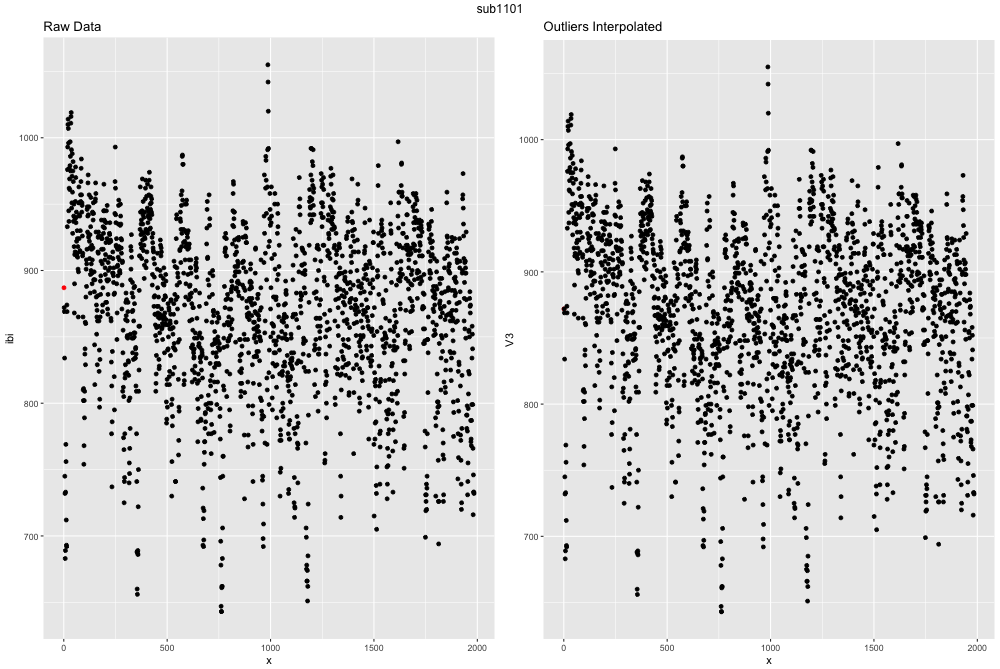
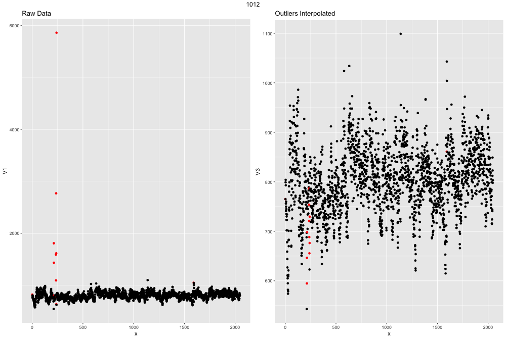

```{r setup, include=FALSE}
knitr::opts_chunk$set(echo = TRUE, warning = FALSE, message = FALSE, error = FALSE, eval = FALSE)
```

# Outlier analysis and graphing
Finally, we have something from the raw data that is useable! We can take a look at
how many outliers are present in our dataset and determine what we want to do with
them. The easiest way to do this is to visualize the differences between the two.
The function `outlier_ibi()` is a function I wrote to determine whether any IBI
are > 300ms apart, and if so 1) remove them, 2) try and impute that missing point
via a timeseries linear interpolation, and 3) plots the data before and after.

```{r}
source('R/hrv_tutorial/physio_functions.R')

outliers_ibi(file = 'sub1101.ibi.gz', path = 'data/hrv_tutorial/')
```



This ECG file is actually exteremely clean and well recorded. If the file had
more outliers the graph might look like this:


