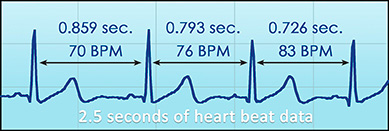
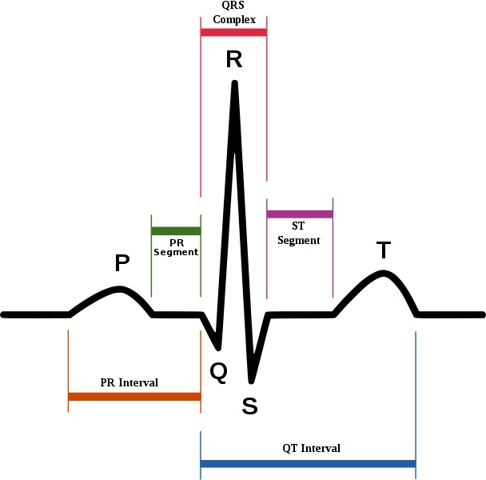
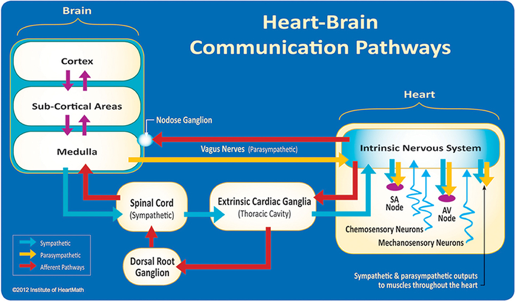

```{r setup, include=FALSE}
knitr::opts_chunk$set(echo = FALSE)
```

## Heart Rate Variablility

- Autonomic nervous system regulates the heart
- HRV: Variation in time between heartbeats
- A healthy heart is not a metronome

## Heart Rate Variablility {.flexbox .vcenter}
<center></center>

## The QRS complex {.flexbox .vcenter}

<center></center>

Denotes peaks and valleys in heart beat

## The QRS complex
- Most HRV analyses presume that the time series has been annotated
- From there, multiple analyses are possible
- But how do we get this annotation?!

## Why should neuroscientists care?

- HRV can be used as a control in MRI analysis
- Brain areas linked to heart control (e.g., prefrontal cortex)

## Why should neuroscientists care? {.flexbox .vcenter}
<center></center>

## Rationale
- Existing programs suck
    + Outdated interfaces
    + Require lots of human interaction
- Should be automated to a higher a degree
- [bit.ly/R_tutorials](http://www.bit.ly/R_tutorials)
