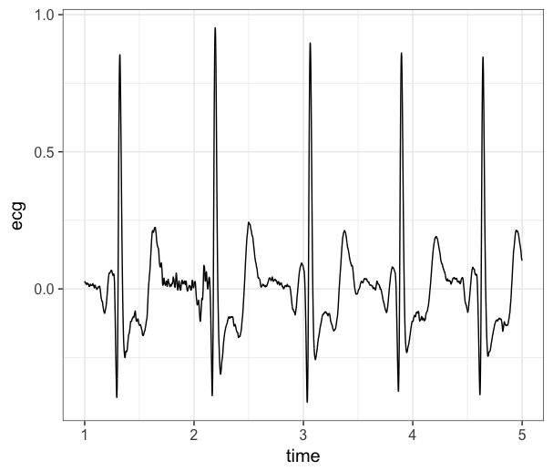

```{r setup, include=FALSE}
knitr::opts_chunk$set(echo = TRUE, warning = FALSE, message = FALSE, error = FALSE, eval = FALSE)
```

# Data Extraction from AcqKnowledge files

Here, we use a python wrapper around the [bioread](https://github.com/njvack/bioread)
package. We are only interested in the ecg and the trigger data, so we
extract them.

```{r}
rawfile <- 'data/hrv_tutorial/sub1101.acq'

use_python('/usr/local/opt/python/libexec/bin/python') # I needed to do this, you probably don't

br <- import('bioread')

df <- py_to_r(br$read_file('data/hrv_tutorial/sub1101.acq'))

recg <- df$channels[[1]]
ecg <- as.vector(recg$data)

rtrigger <- df$channels[[8]]
triggers <- as.vector(rtrigger$data)[-1] # An extra row for some reason?
```

Now, let's add a time variable so we can see keep track of what happens when.

```{r}
time <- seq(0, length(ecg)-1)

options(digits.secs=3)
time_ms <- time/1000
```

Next, we combine all of the data together into a single dataframe and plot the
raw signal just to have a look at it.

```{r}
data <- data.frame(time = time_ms, ecg = ecg, trigger = triggers)

plotdf <- data[1000:5000,] # first 4 seconds

library(ggplot2)

ggplot(plotdf, aes(x=time, y=ecg)) +
  geom_line() +
  theme_bw(base_size = 15)
```



If we are happy with how the raw data looks, we can move forward with
saving the data. We will save it as a `.RDS` file
so we can easily read it back into `R` in the next section.

```{r}
saveRDS(data, file = 'data/hrv_tutorial/sub1101.RDS')
```

