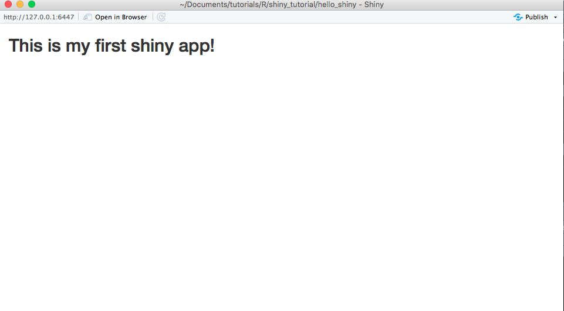
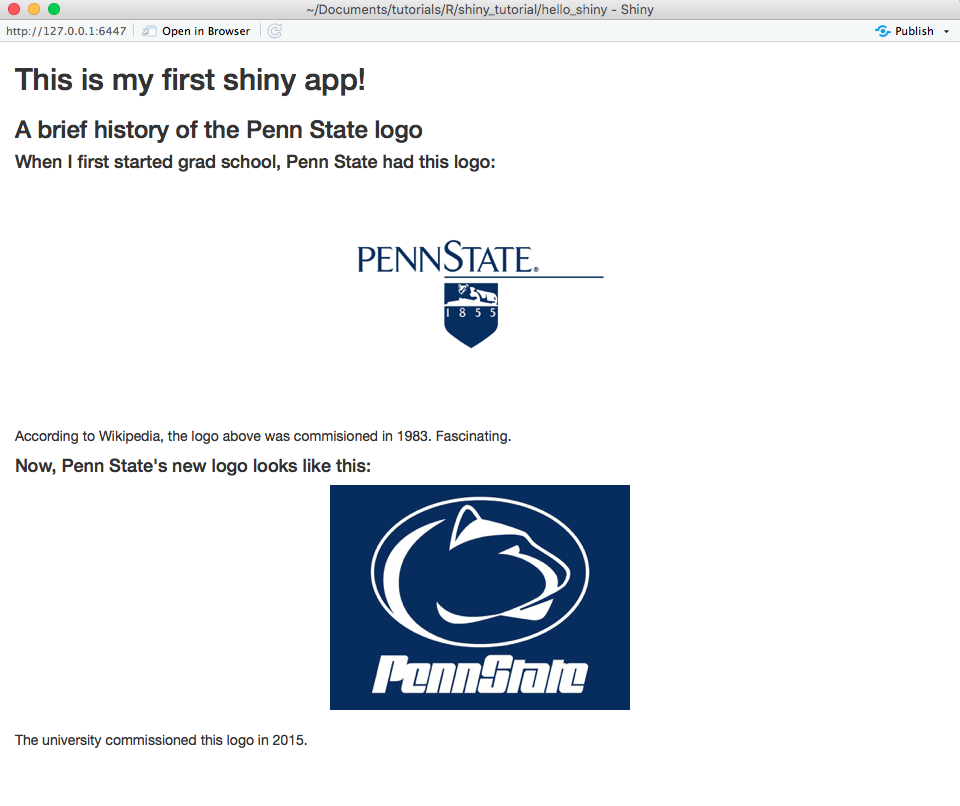

```{r setup, include=FALSE}
knitr::opts_chunk$set(echo = TRUE, eval = FALSE)
```

# Introduction
The goal of this tutorial is to orient you to the different parts of a shiny app,
how each part is structured, and some basic shiny commands/functions. In the first
part, we will build our UI and server. In the second part, we will personalize
the app by allowing for user input that changes the output.

# Hello, Shiny! What makes you special?

## Shiny UI and Server
Each shiny app consists of a `UI` (user interface), or what the user actually
sees on the screen, and a `server`, or how each app should be run. In older
versions of shiny, these had to be separate, consisting of a `UI.R` and a
`server.R` files. Since shiny v0.10.2, these can now be combined into a single
file, `app.R`. All `app.R` files will consist of the following structure:

```{r}
library(shiny)

ui <- fluidPage(
  ## Build what the person sees in the app here
)

server <- function(input, output) {
  ## Build how the app should react to the user/page here
}
```

Each shiny applications ends with a call to let R know that this is an interactive
shiny document with a UI and server. Just add `shiny::shinyApp(ui=ui, server=server)`
to the end of the `app.R` script.

```{r}
library(shiny)

ui <- fluidPage(
  ## Build what the person sees in the app here
)

server <- function(input, output) {
  ## Build how the app should react to the user/page here
}

shiny::shinyApp(ui=ui, server=server)
```

## Running the app
After you save the document as `app.R`, and if you are using RStudio, you should
see a button in the top right corner to run the app.


Clicking this starts the app locally. This approach to running the app is good for
debugging and checking how any changes effected your app immediately.

**A caveat**: Because shiny only recognizes certain file names (`UI.R`, `server.R`, and
`app.R`), each new shiny application needs to be in its own directory. You can run an app
from outside an interactive session by pointing shiny to the directory that the app
is contained in:

```{r}
library(shiny)
runApp("R/shiny_tutorial/hello_shiny/")
```

# Hello, shiny! How do I build you?
Even though both the UI and the server are in one file, for the purposes of this
first walkthrough I am going to break them down into their separate components.
Just know that both of them should exist in the same `app.R` file.

## User Interface
The first thing we want to define is a page. The `fluidPage()` argument is nice
because it automatically defines the boundaries of the page based on the dimensions of
current computer screen, as well as if the user changes the size of the window.

```{r}
ui <- fluidPage(

)
```

We can't run this app yet because we don't have a server function defined yet. Even if we
did, it would just be a blank page. To add *something* to the page, we can add a simple
header/title to the top:

```{r}
ui <- fluidPage(
  titlePanel("This is my first shiny app!")
)
```

**Caveat**: Most shiny functions are "Camel Case", meaning that the second word in a
two-word function is capitalized (e.g., `fluidPage()`, `titlePanel()`).

## The Server

If you want to test your new creation yourself, define what the server should do (in this
case nothing) by pasting the following code underneath the `UI` function:

```{r}
server <- function(input, output) {
  ## Build how the app should react to the user/page here
}

shiny::shinyApp(ui=ui, server=server)
```

Then hit the 'Run app' icon. you should see your new app pop up in a new window.
It should look like the following:




## Crash course in HTML
What is happening "behind the scenes" when we call the `titlePanel()` function? Go ahead
and run `titlePanel("What is happening?")` in the console and see what happens.

```{r eval=TRUE}
titlePanel("What is happening?")
```

If you are familiar with HTML you will immediately recognize the output as a level
two text header. In fact, many of the shiny functions are just convenience wrappers for
html (or JavaScript). There are a number of these wrappers for defining text of
different sizes:

```{r eval=TRUE}
library(shiny)
h1('Header1')
h2('Header2')
#...
h6("Header6")
```

There are also a number of HTML "tags" that are built into shiny for text formatting
aside from headers. You can get a full list of HTML tags by running:

```{r eval=TRUE}
names(tags)
```

You can get details on what each tag does [online](https://shiny.rstudio.com/articles/tag-glossary.html),
but some common ones include:
    - `tags$b()` bolds text
    - `tags$br()` inserts a line break
    - `tags$div()` adds a division, usually to be formatted in a specific way
    - `tags$p()` inserts a paragraph of text
    - `tags$i()` italicizes text
    - `tags$img()` creates an image

**Caveat**: Notice that the tags need to be superseded by `tags$`, but
the header functions do not.

If we wanted to add some of these headers or tags to our app-in-progress, we
would simply add them in our `fluidPage()` function followed by a comma:

```{r}
ui <- fluidPage(
  ## Build what the person sees in the app here
  titlePanel("This is my first shiny app!"),
  h3("Oh hey, a level 3 header exists now"),
  p("Here is some text, but it is left aligned. Curses!"),
  tags$div(
    p("Centered text makes me feel better."),
    style="text-align: center;"
  )
  )
```

**Intermediate exercise**: Go back to the simple app with only a title. Can you use
headers and tags to recreate an app that looks like this:



*Hint*: The `tags$img()` function takes `src`, `width`, and `height` arguments.
You don't have to supply both `width` and `height`. If only one is provided, the image
will scale based off of the one argument. The `src` argument can be a URL or a path to a local
image. For example:

`tags$img(src='http://www.something.com/img1', width = 300)`

If you want to compare the code you wrote to the code I wrote, or if you get stuck,
take a look at the [raw code here](https://raw.githubusercontent.com/d-bohn/tutorials/master/R/shiny_tutorial/hello_shiny/app.R).

# Shiny Gets Personal

Continue to part II of this tutorial where we will take this very basic app and make it more
personal by asking the user for input, and supplying output based on it!

[CONTINUE TO PART II](hello_shinyII.html)
