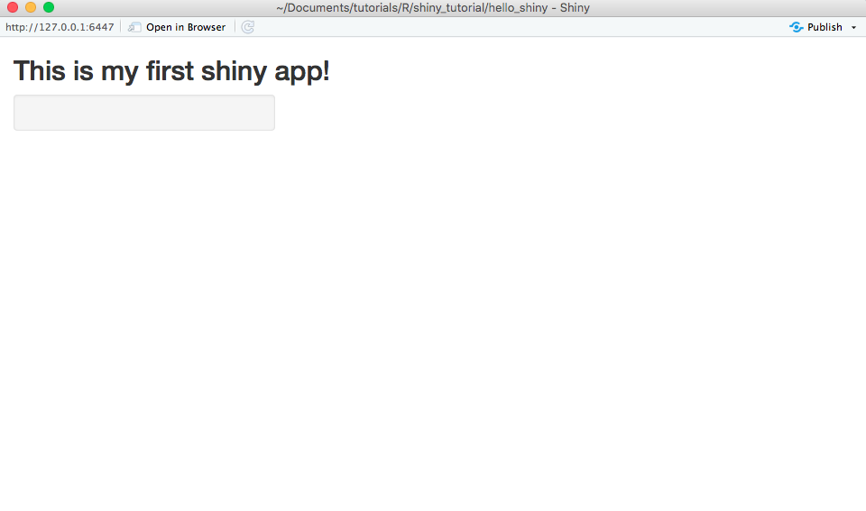
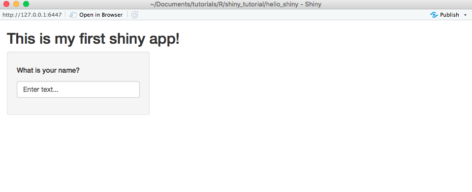
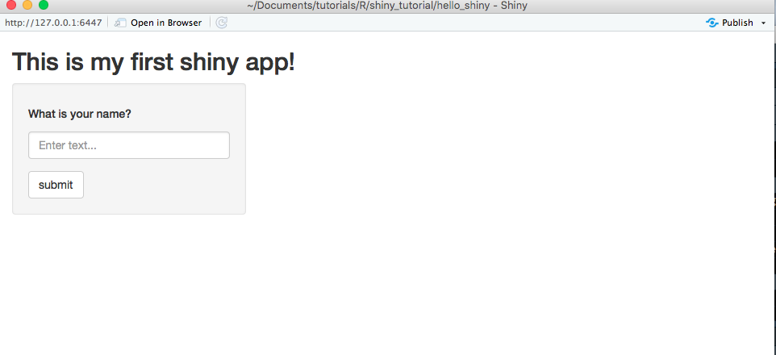
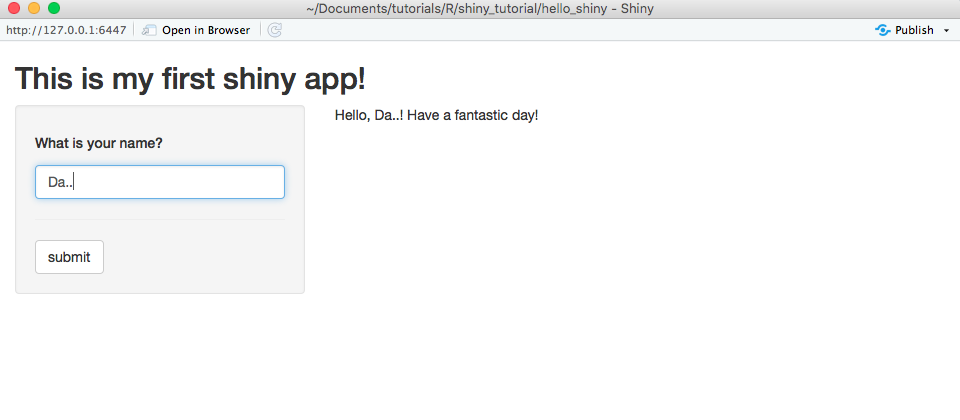

```{r setup, include=FALSE}
knitr::opts_chunk$set(echo = TRUE, eval = FALSE)
```

# Shiny Gets Personal
In this section, we will make our shiny app a little more personal by
having the user provide some input that will change the output within
the app. We will start simple by having the user provide their name so
that a personalized message appears.

More specifically, let's try and build an app that a user is prompted to
input their name, confirm via button press, and have the output greet
them by their name.

# App Layouts
Up until now, we have just been placing headers and text on the app. This is
fine if you want a simple, left-aligned app that consists of pure text and
images. But, once you start adding more complex features, understanding how an
app is laid out on the page can make or break the user experience. There are
several convenient and popular layouts that shiny uses:

- `sidebarLayout()`: Provides a smaller sidebar (defaults to the left) and a
larger area next to it

- `fluidRow()` (grid layout): Provides an easy way to subset a page into rows
and columns using `column()` within the argument

- `tabsetPanel()`: Allows for multiple sub-divided panels within a larger panel

You can see all types layouts in the
[shiny documentation online](https://shiny.rstudio.com/articles/layout-guide.html).
However, be aware that this documentation is slightly outdated.

For this tutorial, we will stick with the simple/standard `sidebarLayout()`. Let's
update our shiny app to have a side-panel.

```{r}
ui <- fluidPage(
  ## This should look familar
  titlePanel("This is my first shiny app!"),
  ## This is new!
  sidebarLayout(sidebarPanel(),
                mainPanel(),
                position = 'left',
                fluid = TRUE)
)
```

When we run our app now, we should see our lovely exclamation that this is our first
shiny app, along with a demarcated subsection to the left, and a larger main panel to
the right:



Notice how--like a lot of non-tidyverse R--we are nesting arguments within each other. That is,
we are starting with the most broad object (the page itself), then move to a subsections
of the page (the title and layout), etc...

**Cateat**: Order matters. Try switching the order of `titlePanel()` with
`sidebarLayout()` and see what happens.

# User Interface Redefined
## User Inputs
Now that we have our app layout setup the way we want, we can begin to construct
the reactive elements. Our first step is to provide some way for users to input
some sort of text. Fortunately, shiny provides several common input/output
[functions](http://shiny.rstudio.com/reference/shiny/latest/).

Here, we add a `textInput()` function to the side-panel. There are many types of inputs
that are included in the base version of `shiny`, such as `numericInput()`, `sliderInput()`,
`radioButtons()` to name but a few.

```{r}
ui <- fluidPage(
  ## This should look familar
  titlePanel("This is my first shiny app!"),
  ## This is new!
  sidebarLayout(sidebarPanel(
    textInput(inputId = "text", label = h5("What is your name?"), placeholder = "Enter text...")
  ),
                mainPanel(),
                position = 'left',
                fluid = TRUE)
)
```

The first argument in `textInput()`, `inputId` can be thought of as the variable name
that the text will be saved as. When we want to access this variable, we will call is
by this `inpudId`.

The second argument, `label`, is the display text for the input box.

The third argument, `placeholder`, is helper text inside the text box.

`textInput()` can handle other arguments, such as specifying the width of the text box,
or defining and initial value. Check `?textInput` to see what you can do!

Nonetheless, at this point, our app should look like this:



Hey, now our app is starting to look more like an app! While we can enter text in
our aptly named text box, there is still no way for the user to submit their
response once they do so!

## User Actions
The most useful user action function is `actionButton()`.

```{r}
ui <- fluidPage(
  titlePanel("This is my first shiny app!"),
  sidebarLayout(sidebarPanel(
    textInput(inputId = "text", label = h5("What is your name?"), placeholder = "Enter text..."),
    ## Building up our sidebar in the order we want the items to fill:
    ## Our text box with question above it, then our action button to submit
    actionButton(inputId = 'submit', lablel = 'submit')
  ),
                mainPanel(),
                position = 'left',
                fluid = TRUE)
)
```

Like the `textInput()` function, the `actionButton()` function takes `inputId` and
`label` arguments so that the button reaction can be identified and the button
has some help text, respectively.



Hot dog! Except, it still doesn't do anything when the user clicks 'submit' :(

# Server Redefined
The other side of reactive programming is that once the app receives a user-defined
response, the app actually does something with it! In this section, we will tell
the app to take the supplied text and print a nice message for our user to
enjoy.

Remember, since up until now we haven't had any reactive elements to our app, our
server function was pretty empty:

```{r}
server <- function(input, output){
  ## Build how the app should react to the user/page here
}
```

However, the arguments that are provided to the function give us some hint as to
what we should expect. Presumably, everything that is being passed back and forth
between the UI and server is contained within `input` and `ouput` objects that are
being passed as arguments to the server function.

From a coding viewpoint, we have to ask ourselves what we want our app to do in
order to decide how to code it. Most simply, we want the app to take the user-defined
input from our text box, concatenate it with some pre-defined message, and then
display it. Recall, that in our UI code we have two actions that the user defines
--the text box and the button. Both of these actions have the `inputId` argument
as part of the their function. We can access these variables within the `input`
object like we would any other object in `R`.

```{r}
server <- function(session, input, output) {
  ## Build how the app should react to the user/page here
    output$name <- renderText({
      paste0('Hello, ', input$text, '! Have a fantastic day!')
  })
}
```

`shiny` provides a number of base functions that allow for reactive rendering of objects,
including text, images, and plots. Here we use the `renderText()` function to take the
user-defined text (stored in `input$text`) and paste it into a personal message that we
store in our output variable as `name`.

If we tried to paste our input variable with out text variable the app would crash.
This is because the app is expecting the text input that we defined in the UI to be
reactive, and when we call for it outside of a reactive expression, it blows up.

## Quick detour back to the UI
Go ahead and try to run the app with our updated server code. Despite defining some
output, we still see nothing! What gives, man?! Well, we are missing one last piece of
code. We need to print our `name` variable back on to the UI. `shiny` comes with several
pre-defined UI output functions for text, images, and plots (seeing a theme here?):

```{r}
ui <- fluidPage(

  titlePanel("This is my first shiny app!"),
  sidebarLayout(sidebarPanel(
    textInput("text", label = h5("What is your name?"), placeholder = "Enter text..."),
    hr(), # Horizontal rule, to space out our objects a bit more...
    actionButton('submit','submit')),
    mainPanel(
      ## Just stick this bad boy here...
      textOutput(outputId = 'name')
    ),
    position = 'left',
    fluid = TRUE)

)
```


The `textOutput()` function takes as its argument the variable name from the
`output` object that should be rendered. In this case, we named it `name`.



Looks good...wait, what? It is updating our message in real time and not waiting
for the user to submit a response by clicking "submit"! But we went through all of that
effort to include a button on our UI! It'd be a shame to waste it.

## Making the app more...reactive
The last thing to do is have our app be patient and wait for the user to signal they are
done by submitting their response via the button. This is achieved by setting up an
"observer," or an if-then statement that is constantly on the lookout for when a condition
is met. In our case, we want our observer to trigger an action when a button "event" occurs.

We create an "observer" by calling the `observeEvent()` function. This function takes
a reactive "event" (`eventExpr`) and what to do if that event occurs (`handlerExpr`)
as input.

Recall that we cleverly gave our submit button an `inputId` of `submit`. Therefore, if
our button event occurs (i.e., gets clicked), the parameter `submit` that exists inside
our `input` object will be `TRUE`. The only other thing we need to pass to the observer
is what to do when this event occurs, which we already defined above in the `renderText()`
function.

```{r}
server <- function(input, output) {
  ## Make an observer!
  observeEvent(eventExpr = input$submit, handlerExpr = {
    output$name <- renderText({
      paste0('Hello, ', input$text, '! Have a fantastic day!')
    })
  })
}
```

The final product (and what your `app.R` file should look like) is as follows:

```{r}
ui <- fluidPage(
  titlePanel("This is my first shiny app!"),
  sidebarLayout(sidebarPanel(
    textInput("text", label = h5("What is your name?"), placeholder = "Enter text..."),
    hr(),
    actionButton('submit','submit')),
    mainPanel(
      textOutput('name')
    ),
    position = 'left',
    fluid = TRUE)
)

server <- function(input, output) {
  ## Build how the app should react to the user/page here
  observeEvent(eventExpr = input$submit, handlerExpr = {
    output$name <- renderText({
      paste0('Hello, ', input$text, '! Have a fantastic day!')
    })
  })
}

shiny::shinyApp(ui=ui, server=server)
```


Continue on to a more [intermediate example](io_app.html)