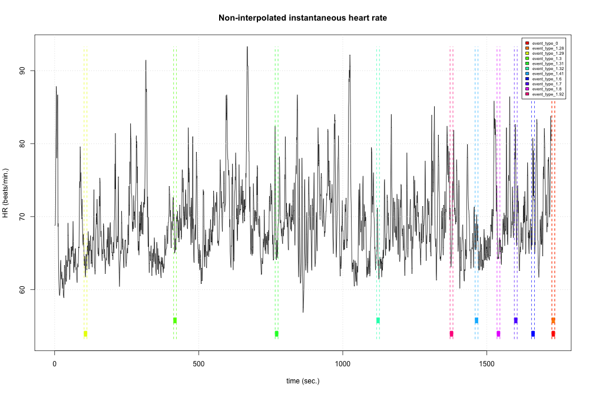
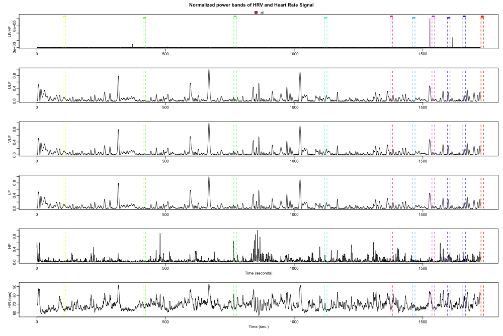

```{r setup, include=FALSE}
knitr::opts_chunk$set(echo = TRUE, warning = FALSE, message = FALSE, error = FALSE, eval = FALSE)
```

We finally have our cleaned IBI time series (derived from the cleaned and annotated ECG time series)!
From here, we can use the `RHRV` package to analyze our data in a number of ways. Below, I build
the time series and perform a frequency analysis on it. Finally, we will extract the high frequency
signal for two of the marked points of interest.

First, we load the data and create a new, blank HRV class using `CreateHRVData()`.
This is where we will store everything as we proceed.

```{r}
library(RHRV)

# Set up some global variables
path <- 'data/hrv_tutorial/'
file <- 'sub1101_ecg_clean.txt'
name <- sub("*_ecg_clean.txt", "", file)

hrv.data = CreateHRVData()
hrv.data = SetVerbose(hrv.data, FALSE)
hrv.data = LoadBeatRR(hrv.data, RecordName=file.path(path,file), RecordPath=".", scale = .001)
```

Below, we load the trigger file we created in the previous step
and extract the info we need to overlay on the time series so the
program knows where we want it to derive the statistics from. We add
the triggers using `AddEpisodes()`.

```{r}
# We add the info about the episodes
file_ev <- sub("*_ecg_clean.txt", "", file)

load(file.path(path,paste0(name,"_trigger.RData")))
InitTime <- episodes$InitTime
Type <- episodes$trigger
Duration <- episodes$Duration
Value <- episodes$Value

hrv.data = AddEpisodes(hrv.data, InitTimes = episodes$InitTime, 
                       Tags = episodes$Type,
                       Durations = episodes$Duration,
                       Values = episodes$Value)
```

Next, we can derive the instantaneous heart rate time series by using the cleaned IBI
time series. This is possible because "instantaneous heart rate can be defined as the
inverse of the time separation between two consecutive heart beats."

```{r}
hrv.data = BuildNIHR(hrv.data)
hrv.data = FilterNIHR(hrv.data)

# plot all tags
# png(filename = paste("data/plots/",name,"_tagged_plot.png",sep=""), width=1000, height=669,
#     units="px")
PlotNIHR(hrv.data, Tag=episodes$Type)
# dev.off()

hrv.data = InterpolateNIHR(hrv.data, freqhr = 4)
```



Once everything is loaded into our `hrv.data` object, we can perform
the frequency analysis with two commands: one to build a
frequency analysis sub-object in our `hrv.data` object, and another
to actual calculate the powerband. We can plot the powerband to check for
any anomalies.

```{r}
#Perform frequency analysis
##Calculating spectrogram and power per band using wavelet analysis:
hrv.data = CreateFreqAnalysis(hrv.data)
hrv.data = CalculatePowerBand(hrv.data, indexFreqAnalysis = 1, type="wavelet",
                              wavelet="d4", bandtolerance=0.1)

# plot powerband for all files
# png(filename = paste("data/plots/",name,"_powerband.png",sep=""), width=1000, height=669,
#     units="px")
PlotPowerBand(hrv.data, normalized = TRUE, hr = TRUE, Tag = "all")
# dev.off()
```



Once we are satisfied with the frequency analysis, we can begin to chop up
the data into parts that we will use to compare.

```{r}
# Save the data by stimulus type:
splitting.data1 = SplitPowerBandByEpisodes(hrv.data, indexFreqAnalysis = 1, Tag = c("event_type_1.29"))
Baseline <- log(mean(splitting.data1$OutEpisodes$HF))

splitting.data2 = SplitPowerBandByEpisodes(hrv.data, indexFreqAnalysis = 1, Tag = c("event_type_1.92"))
Task <- log(mean(splitting.data2$OutEpisodes$HF))

subject_nr <- readr::parse_number(file)
sub <- cbind.data.frame(subject_nr,Baseline,Task)

write.table(sub, file = "data/hrv_tutorial/hrv_extract_data.csv", sep = ",", append = FALSE,
            col.names = TRUE, row.names = FALSE)
# Clean up
rm(list = ls())
```

Let's make sure that our data were saved properly.

```{r eval=TRUE}
head(read.csv('data/hrv_tutorial/hrv_extract_data.csv'))
```

